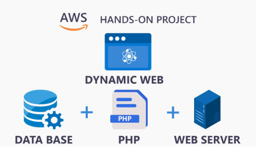
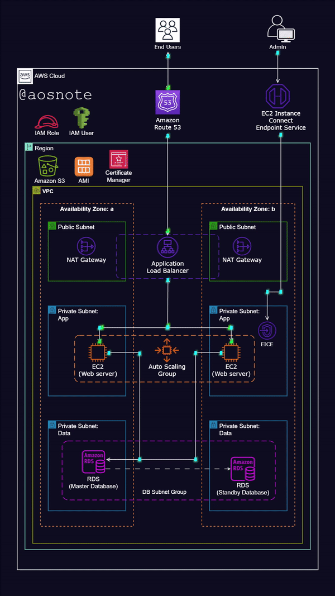

# Dynamic Website Hosting on AWS
Showcase of Cloud Infrastructure, Automation, Scalability, and Security
This project demonstrates the deployment and hosting of a dynamic website on Amazon Web Services (AWS), utilizing a robust, scalable, and highly available architecture. It highlights key aspects of cloud infrastructure, automation, security, and performance management.

# 📦Project Overview
This project showcases how to build, deploy, and host a dynamic website on AWS. The architecture is designed to ensure high availability, fault tolerance, scalability, and security using various AWS services, such as:

- EC2 Instances for web hosting.
- VPC with public and private subnets for network isolation.
- Auto Scaling and Application Load Balancer (ALB) for dynamic scaling and traffic distribution.
- SSL/TLS certificates for secure communication.
- Route 53 for DNS management.

## Architecture Overview

# ⚙️ Architecture Diagram

- **Virtual Private Cloud (VPC)**: with Public and Private Subnets
- **Internet Gateway** to allow internet access
- **Application Load Balancer (ALB)** for traffic distribution
- **EC2 Instances** running the website in private subnets
- **Auto Scaling** Group for elasticity
- **AWS Certificate Manager** for SSL certificates
- **Route 53** for domain management
- **S3 Bucket** for storing assets and application code
- **RDS** for database management

# 🔧 Technologies Used
**AWS EC2**: For hosting the web application.
**AWS VPC**: For creating a secure and isolated network.
**AWS Auto** Scaling: For automatic scaling of EC2 instances.
**AWS Application Load Balancer**: For distributing traffic across instances.
**AWS RDS**: For database management.
**AWS S3**: For storing static files.
**AWS Route 53**: For DNS management.
**AWS Certificate Manager**: For securing communications via SSL.

# 🏗️ Deployment Instructions
Follow these steps to set up the project on AWS:

## How It Works:
- EC2 Instances: Host the dynamic website within private subnets, ensuring high availability and security.
- Application Load Balancer (ALB): Distributes traffic to EC2 instances based on availability and traffic load.
- Auto Scaling Group: Automatically adjusts the number of EC2 instances in response to traffic demand, ensuring consistent performance.
- RDS Database: Manages application data with secure access controlled by IAM roles.
- CloudWatch & SNS: Provides monitoring and notifications for system performance and potential issues.
- 
# Key Features
-Scalability: Automatically scales EC2 instances based on traffic.
-Fault Tolerance: Deploys across multiple availability zones for improved availability.
-Security: Uses VPC, security groups, and SSL/TLS certificates to protect data.
-Automation: Deployment and provisioning are automated through scripts and infrastructure-as-code (IaC) practices.

# Future Enhancements
-CI/CD Pipeline: Integrate with Jenkins or GitHub Actions for automated continuous integration and deployment.
-Containerization: Transition the application to AWS ECS or EKS for a microservices-based containerized approach.
-Advanced Monitoring: Implement CloudWatch Alarms for proactive monitoring and automated remediation.

# Troubleshooting & Solutions
**Problem 1: Unable to connect to EC2 instances**
-Solution: Verify that the Security Group allows inbound traffic on the necessary ports (80 for HTTP, 443 for HTTPS) and that the correct key pair is used for SSH access.
**Problem 2: Auto Scaling not working as expected**
-Solution: Check the Auto Scaling Group settings, ensuring the desired capacity, minimum, and maximum instances are properly configured. Also, ensure the ALB is properly registered with the target group.

**Problem 3: Database connection issues**
-Solution: Confirm that the RDS Security Group permits inbound traffic from the EC2 instances' security group and that database credentials are correctly set in the .env file.

**Problem 4: S3 sync fails**
-Solution: Ensure the IAM user has sufficient permissions to access the S3 bucket and that the correct bucket name and path are used in the sync command.

    
